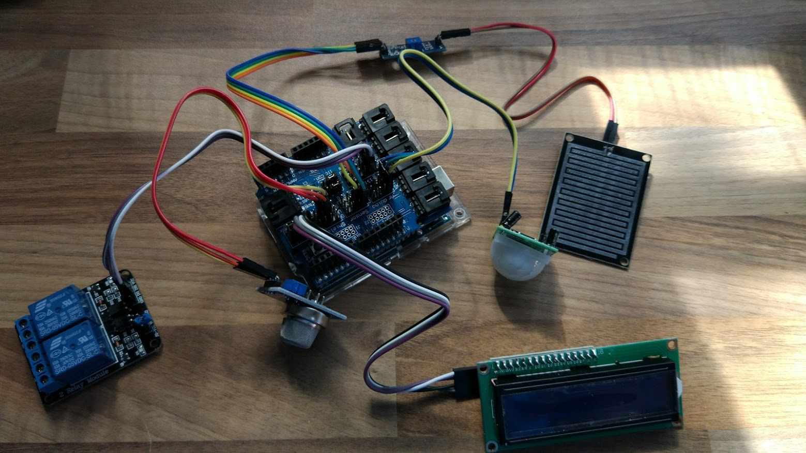
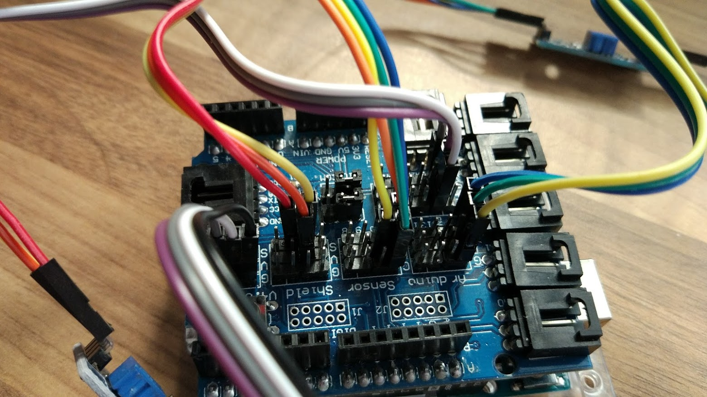
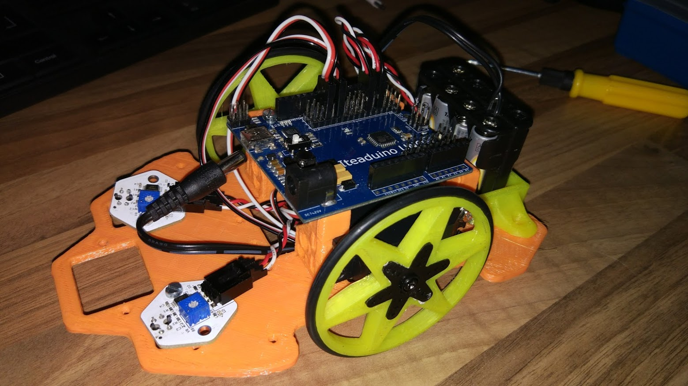

# Propuesta

Kit de conexión sencilla (componentes y cables de 3/4 pines)

Uso de impresión 3D. Se usan las impresoras 3D para imprimir los chasis de los robots y se hacen o modifican diseños sencillos con Tinkercad

Proyectos: domótica, estación meteorilógica, robots, experimentos de física (medida de péndulo, de velocidades y aceleraciones …)
